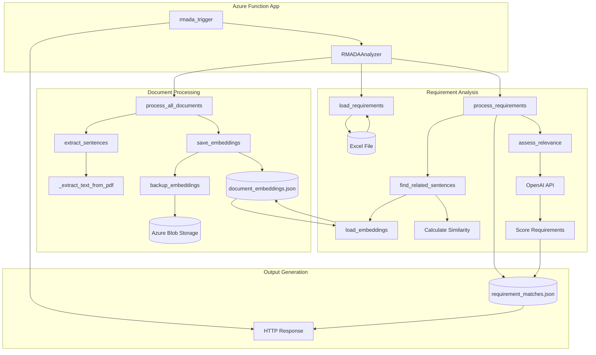

```mermaid
flowchart TD
    subgraph "Azure Function App"
        A[rmada_trigger] --> B[RMADAAnalyzer]
    end
    
    subgraph "Document Processing"
        B --> C[process_all_documents]
        C --> D[extract_sentences]
        D --> E[_extract_text_from_pdf]
        C --> F[save_embeddings]
        F --> G[(document_embeddings.json)]
        F --> H[backup_embeddings]
        H --> I[(Azure Blob Storage)]
    end
    
    subgraph "Requirement Analysis"
        B --> J[load_requirements]
        J --> K[(Excel File)]
        B --> L[process_requirements]
        L --> M[find_related_sentences]
        M --> N[load_embeddings]
        N --> G
        M --> O[Calculate Similarity]
        L --> P[assess_relevance]
        P --> Q[OpenAI API]
        Q --> R[Score Requirements]
    end
    
    subgraph "Output Generation"
        L --> S[(requirement_matches.json)]
        A --> T[HTTP Response]
    end
    
    %% Data flow connections
    G --> N
    K --> J
    R --> S
    S --> T
```